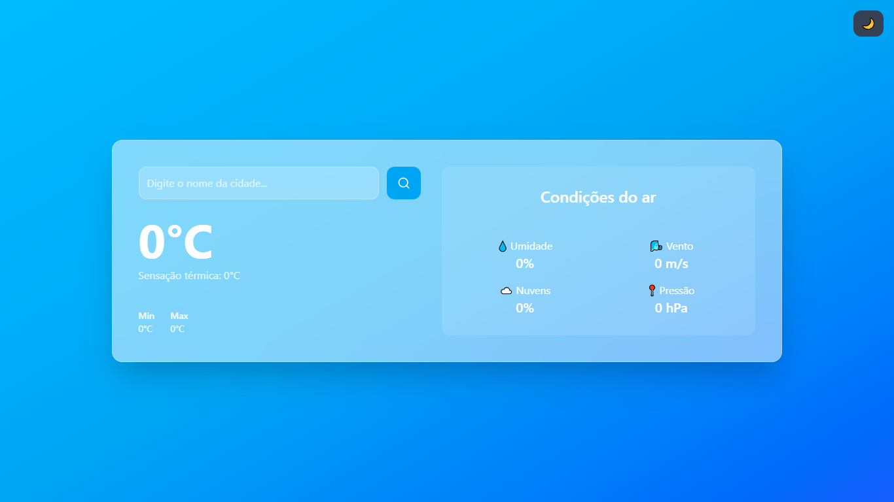
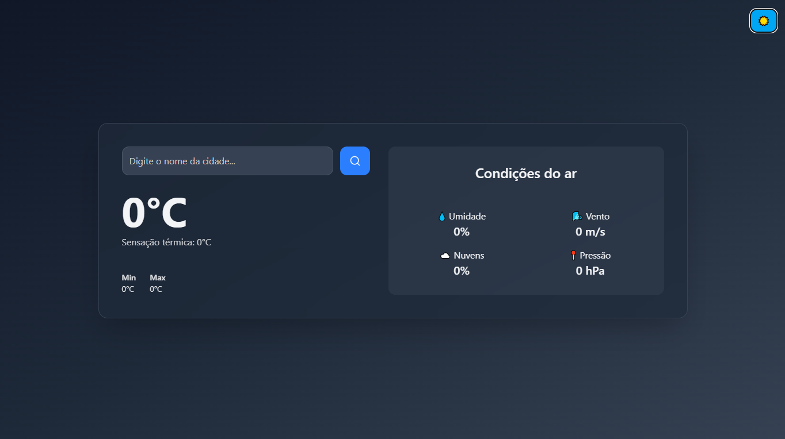

# 🌦️ Weather App

Pequeno aplicativo feito para consultas metereológicas utilizando  **Vite + React + TypeScript + Tailwind CSS**, e consumindo a api **OpenWeather API** para exibir informações em tempo real.

---

## ✨ Funcionalidades

- Pesquisa de cidades em tempo real  
- Exibição de temperatura atual, mínima e máxima  
- Descrição do clima e sensação térmica  
- Informações de umidade, vento, nuvens e pressão atmosférica  
- Alternância entre **modo claro e escuro**  
- Layout **responsivo**, adaptado para mobile e desktop  

---

## 🖼️ Preview

---

## 🚀 Tecnologias Utilizadas

- [React](https://react.dev/)  
- [TypeScript](https://www.typescriptlang.org/)  
- [Tailwind CSS](https://tailwindcss.com/)  
- [Vite](https://vitejs.dev/)  
- [OpenWeather API](https://openweathermap.org/api)

---

## ⚙️ Como Rodar o Projeto Localmente

1. **Clone o repositório:**
   git clone https://github.com/YoshiDavi/weather-app.git

2. **Acesse a pasta do projeto:**
  cd weather-app

3. **Instale as dependências**
  npm install

4. **Crie um arquivo .env na pasta raiz e adicione:**
  VITE_API_KEY=sua_chave_aqui

5. **Rode o servidor localmente:**
  npm run dev

O app estará disponível em:
👉 http://localhost:5173

------------------------------------------------------------

## Estrutura do projeto

weather-app/  
├── public/  
├── src/ 
|   ├── components/
|   ├── services/
│   ├── img/  
│   ├── App.tsx  
│   ├── index.css  
│   ├── main.tsx  
│   └── ...  
├── .env  
├── .gitignore  
├── package.json  
├── tailwind.config.ts  
└── vite.config.ts  

------------------------------------------------------------

## Autor
Davi Pereira
📧 davipereira24062003@gmail.com
🔗 github.com/YoshiDavi
